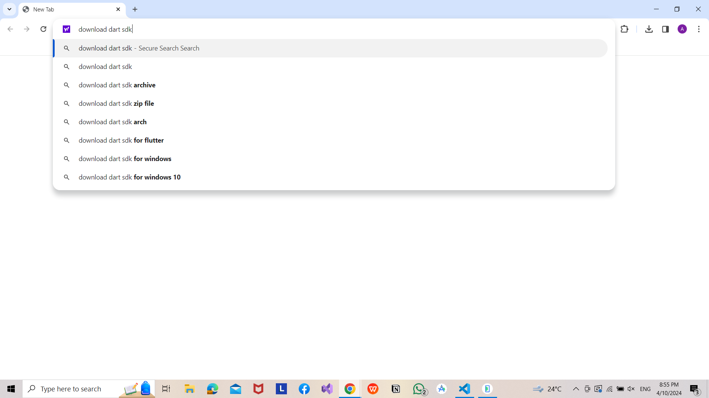

# Install Dart SDK

"Hello everyone, today we're going to set up the environment we really need to be able to write code in Dart, which is the language we're going to learn.

First, we'll open Chrome and go to the search bar. Then, we'll search for 'download Dart SDK'. This is the first thing we need. I'll click on the first link that appears.

The Dart SDK contains the tools we can use to write Dart code. We'll download it by clicking 'download as zip file' and selecting our operating system.

After that, we'll go to the location where the file was downloaded and extract it.

I'm interested in the 'bin' folder. I'll enter it, copy its path, and add it to the system environment variables. To do this, I'll right-click on 'This PC', select 'properties', then 'advanced system settings', then 'environment variables'. I'll click on 'path', then 'new', and add the path of the 'bin' folder.

The goal of this step is to let the computer know that the Dart SDK is present on the system and aware that there's a programming language called Dart.

To make sure it's aware of this, I'll open the command prompt and type 'dart --version'. If the version is displayed, then everything is set up correctly."
